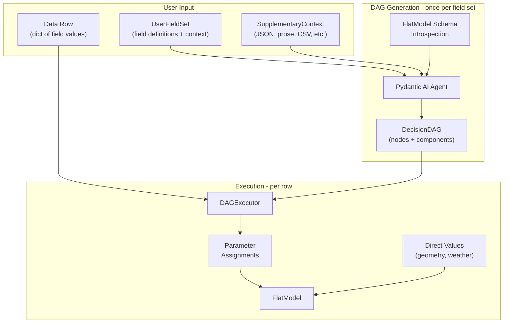

# Decision DAG Module for LLM-Driven FlatModel Inference

## Context

The existing pipeline (`[epinterface/sbem/components/composer.py](epinterface/sbem/components/composer.py)`) resolves building energy model components from a Prisma database using declarative selector trees. The existing `[epinterface/sbem/fields/spec.py](epinterface/sbem/fields/spec.py)` defines simple field schemas (categorical options, numeric ranges) for GIS data.

The new module replaces the database-backed component library approach with an **LLM-generated decision DAG**: users describe their available fields, and an LLM produces a structured graph that maps user data rows to all ~72 parameters of `[FlatModel](epinterface/sbem/flat_model.py)` (line 629).

## Architecture




## New Module: `epinterface/sbem/decision_dag/`

### 1. `fields.py` -- User Field Definitions

Extends the patterns from `[spec.py](epinterface/sbem/fields/spec.py)` with richer metadata for LLM consumption.

```python
class FieldType(str, Enum):
    CATEGORICAL = "categorical"
    NUMERIC = "numeric"
    PLAINTEXT = "plaintext"

class UserFieldDefinition(BaseModel):
    name: str
    field_type: FieldType
    description: str  # English description of what this field represents
    data_quality_description: str = ""  # How reliable/complete this field is
    # categorical fields
    categories: list[str] | None = None
    # numeric fields
    min_value: float | None = None
    max_value: float | None = None
    unit: str | None = None

class SupplementaryContext(BaseModel):
    title: str  # e.g. "HVAC System Frequency Distribution"
    content: str  # Plain text, JSON, markdown, CSV -- any format
    format_hint: str = "plaintext"  # "plaintext", "json", "csv", "markdown", etc.

class UserFieldSet(BaseModel):
    fields: list[UserFieldDefinition]
    context_description: str = ""  # Overall project context
    region_description: str = ""  # Geographic/climate context
    building_stock_description: str = ""  # Building stock characteristics
    supplementary_context: list[SupplementaryContext] = []
```

`supplementary_context` allows the user to attach any number of unstructured knowledge documents that help the LLM build a better DAG. Examples:

- A JSON object describing construction typology distributions (e.g. `{"wood_frame": 0.6, "masonry": 0.3, "steel": 0.1}`)
- A plain English paragraph about regional building codes and common retrofit practices
- A CSV-like table of HVAC system types and their prevalence by building age
- Notes on local energy audit findings, weatherization program data, or utility rebate patterns
- Historical construction practice descriptions (e.g. "pre-1940 buildings in this region typically have uninsulated double-wythe brick walls")

The `format_hint` helps the LLM interpret the content correctly. All supplementary context is injected into the LLM user message alongside the field definitions.

Validators ensure `categories` is set for categorical fields, `min_value`/`max_value` for numeric, etc.

### 2. `dag.py` -- Decision DAG Schema (LLM Output)

This is the structured output the LLM produces. Uses discriminated unions for node types.

**Conditions:**

```python
class ComparisonOperator(str, Enum):
    EQ = "eq"
    NEQ = "neq"
    LT = "lt"
    LTE = "lte"
    GT = "gt"
    GTE = "gte"
    IN = "in"
    NOT_IN = "not_in"
    CONTAINS = "contains"
    IS_MISSING = "is_missing"
    IS_NOT_MISSING = "is_not_missing"

class FieldCondition(BaseModel):
    field: str  # references a UserFieldDefinition.name
    operator: ComparisonOperator
    value: Any = None  # not needed for is_missing / is_not_missing
```

**Node types (discriminated union on `node_type`):**

- **ConditionNode** -- Evaluates branches against a user data row, routes to the first matching target. Has an optional `default_target_id` fallback.

```python
class ConditionalBranch(BaseModel):
    condition: FieldCondition
    target_node_id: str

class ConditionNode(BaseModel):
    node_type: Literal["condition"] = "condition"
    id: str
    description: str
    branches: list[ConditionalBranch]
    default_target_id: str | None = None
```

- **AssignmentNode** -- Directly assigns values to FlatModel parameters. Can chain to further nodes via `next_node_ids`.

```python
class AssignmentNode(BaseModel):
    node_type: Literal["assignment"] = "assignment"
    id: str
    description: str
    assignments: dict[str, Any]  # FlatModel field name -> value
    next_node_ids: list[str] = []
```

- **ComponentRefNode** -- References a named IntermediateComponent (a reusable bundle of assignments). Enables the "high performing single family wall" pattern.

```python
class ComponentRefNode(BaseModel):
    node_type: Literal["component_ref"] = "component_ref"
    id: str
    description: str
    component_id: str
    next_node_ids: list[str] = []
```

**Intermediate Components and the DAG itself:**

```python
class IntermediateComponent(BaseModel):
    id: str
    name: str  # Human-readable (e.g. "High Performance SF Wall")
    description: str
    assignments: dict[str, Any]  # FlatModel field name -> value

DAGNode = Annotated[
    ConditionNode | AssignmentNode | ComponentRefNode,
    Field(discriminator="node_type"),
]

class DecisionDAG(BaseModel):
    description: str  # LLM's summary of its reasoning
    components: list[IntermediateComponent]
    nodes: list[DAGNode]
    entry_node_ids: list[str]  # Root(s) of the graph
```

Multiple entry nodes allow independent sub-DAGs for orthogonal parameter groups (e.g., one sub-DAG for envelope, another for HVAC, another for schedules).

### 3. `executor.py` -- DAG Execution Engine

Processes a single data row through the DAG via BFS from entry nodes:

```python
class DAGExecutionTrace(BaseModel):
    visited_node_ids: list[str]
    applied_component_ids: list[str]
    unresolved_fields: list[str]  # FlatModel fields not assigned

class DAGExecutionResult(BaseModel):
    assignments: dict[str, Any]
    trace: DAGExecutionTrace

class DAGExecutor:
    def __init__(self, dag: DecisionDAG): ...
    def execute(self, row: dict[str, Any]) -> DAGExecutionResult: ...
    def execute_to_flat_model(
        self,
        row: dict[str, Any],
        direct_values: dict[str, Any] | None = None,
    ) -> FlatModel: ...
```

Key execution rules:

- BFS from `entry_node_ids`; each node visited at most once (cycle protection)
- **ConditionNode**: evaluates branches in order, follows first match (or default)
- **AssignmentNode**: merges `assignments` into result, then follows `next_node_ids`
- **ComponentRefNode**: looks up component, merges its assignments, then follows `next_node_ids`
- Later assignments override earlier ones (allows refinement chains)
- `IS_MISSING` operator handles absent/null fields gracefully
- `execute_to_flat_model` merges DAG assignments with `direct_values` (direct wins) and constructs a `FlatModel`

### 4. `schema_utils.py` -- FlatModel Schema Introspection

Generates a prompt-friendly description of all FlatModel fields for the LLM system prompt:

```python
def get_flat_model_schema_description() -> str:
    """Introspect FlatModel and return a structured description of all fields."""
```

This will iterate over `FlatModel.model_fields`, extracting:

- Field name, Python type, constraints (ge, le, enum values)
- Grouping by parameter category (schedules, setpoints, HVAC, etc.)

Also provides DAG validation:

```python
def validate_dag_assignments(dag: DecisionDAG) -> list[str]:
    """Validate that all assignments reference valid FlatModel fields
    and that values are compatible with field types/constraints."""
```

### 5. `agent.py` -- Pydantic AI Agent

Uses `pydantic-ai` with structured output. Depends on `pydantic-ai` being added as a dependency.

```python
from pydantic_ai import Agent

dag_agent = Agent(
    "openai:gpt-4o",  # configurable
    result_type=DecisionDAG,
    system_prompt=...,  # includes FlatModel schema from schema_utils
)
```

The system prompt will instruct the LLM to:

- Analyze the user's field definitions, their data quality, and regional context
- Incorporate all supplementary context documents (building stock distributions, construction typology info, local code references, audit data, etc.) to inform parameter choices and component definitions
- Design a DAG that handles sparse data (heavy use of `IS_MISSING` checks with sensible defaults)
- Use intermediate components for common parameter bundles, informed by the supplementary context (e.g., if the user provides HVAC frequency data, create components matching those system archetypes)
- Ensure every required FlatModel field is assigned on every possible execution path
- Apply regional building code knowledge and climate-appropriate defaults

The user message will be constructed from a `UserFieldSet` instance. It will include:

1. The structured field definitions with types, descriptions, and data quality notes
2. Each `SupplementaryContext` entry rendered as a titled, labeled section with its format hint so the LLM can interpret JSON, CSV, prose, etc. correctly
3. The regional and building stock context strings

A convenience function wraps the agent call:

```python
async def generate_dag(
    field_set: UserFieldSet,
    model: str = "openai:gpt-4o",
) -> DecisionDAG: ...
```

### 6. `validation.py` -- Structural DAG Validation

Validates the DAG after LLM generation:

- All `target_node_id` and `next_node_ids` reference existing node IDs
- All `component_id` references point to existing components
- All `entry_node_ids` exist
- The graph is acyclic (topological sort check)
- All referenced user fields exist in the `UserFieldSet`
- All FlatModel field names in assignments are valid
- Coverage check: every FlatModel field (excluding geometry/weather, which come from `direct_values`) is assigned on at least one path

### 7. `__init__.py` -- Public API

Exports the key types and functions:

- `UserFieldDefinition`, `UserFieldSet`, `FieldType`, `SupplementaryContext`
- `DecisionDAG`, `IntermediateComponent`, `ConditionNode`, `AssignmentNode`, `ComponentRefNode`
- `DAGExecutor`, `DAGExecutionResult`
- `generate_dag`
- `validate_dag_assignments`, `get_flat_model_schema_description`

## Dependency Change

Add `pydantic-ai` to `[project.dependencies]` in `[pyproject.toml](pyproject.toml)`:

```
uv add pydantic-ai
```

## File Summary


| New file                                        | Purpose                                            |
| ----------------------------------------------- | -------------------------------------------------- |
| `epinterface/sbem/decision_dag/__init__.py`     | Public exports                                     |
| `epinterface/sbem/decision_dag/fields.py`       | User field definitions (input schema)              |
| `epinterface/sbem/decision_dag/dag.py`          | DAG node types and DecisionDAG (output schema)     |
| `epinterface/sbem/decision_dag/executor.py`     | Row-level DAG execution engine                     |
| `epinterface/sbem/decision_dag/schema_utils.py` | FlatModel introspection + DAG-vs-schema validation |
| `epinterface/sbem/decision_dag/validation.py`   | Structural graph validation                        |
| `epinterface/sbem/decision_dag/agent.py`        | Pydantic AI agent + prompt engineering             |
| `tests/test_decision_dag/test_fields.py`        | Tests for field definitions                        |
| `tests/test_decision_dag/test_dag.py`           | Tests for DAG serialization/deserialization        |
| `tests/test_decision_dag/test_executor.py`      | Tests for DAG execution with mock DAGs             |
| `tests/test_decision_dag/test_validation.py`    | Tests for structural + schema validation           |


