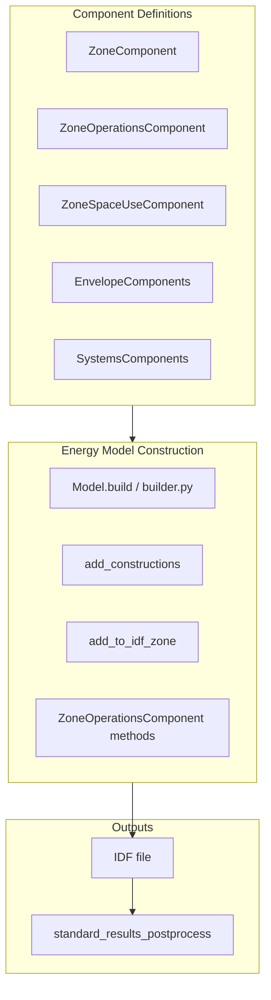

# Exhaustive Review Plan: SBEM Component No-Op Fields

## Objective

Identify every component field in `epinterface/sbem/` that is a no-op: defined and stored but never referenced in any computation that ultimately affects energy model construction (IDF generation, simulation, or post-processing).

## Scope

- **In scope**: All Pydantic/dataclass component fields under [epinterface/sbem/](epinterface/sbem/) (components, materials, envelope, systems, schedules, operations, zones)
- **Out of scope**: `fields/spec.py` (GIS/semantic model fields, not SBEM components), Prisma schema (persistence layer), external notebooks/demos

## Data Flow Overview

**Key entry points for field usage:**

1. [builder.py](epinterface/sbem/builder.py): `Model.build()` → `add_constructions()`, `add_zone_lists()`, `add_to_idf_zone()`
2. [operations.py](epinterface/sbem/components/operations.py): `add_water_use_to_idf_zone()`, `add_thermostat_to_idf_zone()`, `add_conditioning_to_idf_zone()`
3. [space_use.py](epinterface/sbem/components/space_use.py): `add_people_to_idf_zone()`, `add_lights_to_idf_zone()`, `add_equipment_to_idf_zone()`
4. [envelope.py](epinterface/sbem/components/envelope.py): `add_to_idf()`, `add_infiltration_to_idf_zone()`, `ep_material` property
5. [builder.py](epinterface/sbem/builder.py): `standard_results_postprocess()` (Fuel, COP for fuel normalization)

## Methodology

### Phase 1: Catalog All Component Fields

Create a field inventory by walking each component module:

| Module                                                                | Components                                                                                                                                                             |
| --------------------------------------------------------------------- | ---------------------------------------------------------------------------------------------------------------------------------------------------------------------- |
| [components/zones.py](epinterface/sbem/components/zones.py)           | ZoneComponent                                                                                                                                                          |
| [components/operations.py](epinterface/sbem/components/operations.py) | ZoneOperationsComponent                                                                                                                                                |
| [components/space_use.py](epinterface/sbem/components/space_use.py)   | OccupancyComponent, LightingComponent, EquipmentComponent, ThermostatComponent, WaterUseComponent, ZoneSpaceUseComponent                                               |
| [components/envelope.py](epinterface/sbem/components/envelope.py)     | GlazingConstructionSimpleComponent, InfiltrationComponent, ConstructionLayerComponent, ConstructionAssemblyComponent, EnvelopeAssemblyComponent, ZoneEnvelopeComponent |
| [components/systems.py](epinterface/sbem/components/systems.py)       | ThermalSystemComponent, ConditioningSystemsComponent, VentilationComponent, ZoneHVACComponent, DHWComponent                                                            |
| [components/materials.py](epinterface/sbem/components/materials.py)   | EnvironmentalMixin, ConstructionMaterialProperties, ConstructionMaterialComponent                                                                                      |
| [components/schedules.py](epinterface/sbem/components/schedules.py)   | DayComponent, WeekComponent, YearComponent                                                                                                                             |
| [common.py](epinterface/sbem/common.py)                               | MetadataMixin (Category, Comment, DataSource, Version)                                                                                                                 |

### Phase 2: Trace Field References

For each field, search the codebase for references:

1. **Grep-based search**: Use `rg "\.FieldName"` and `rg "FieldName"` (with context) across `epinterface/`
2. **Call-chain tracing**: Follow `add_to_idf`, `add_*_to_idf_zone`, `ep_material`, `effective_system_cop`, etc.
3. **Validation-only usage**: Fields used only in `@model_validator` or `@field_validator` affect schema validation but not IDF output—document as "validation-only" (arguably no-op for energy model)

### Phase 3: Classify and Report

For each field, classify as:

- **Used**: Referenced in IDF construction, post-processing, or downstream simulation logic
- **No-op**: Never referenced in energy model construction path
- **Validation-only**: Used only in Pydantic validators (schema integrity)
- **Unused assembly**: Entire sub-component (e.g., ExternalFloorAssembly) never wired to surface handlers

## Known No-Op Candidates (from initial exploration)

The following have been preliminarily identified and should be verified:

### InfiltrationComponent ([envelope.py:67-97](epinterface/sbem/components/envelope.py))

- `ConstantCoefficient`, `TemperatureCoefficient`, `WindVelocityCoefficient`, `WindVelocitySquaredCoefficient`, `AFNAirMassFlowCoefficientCrack` — **commented out** in `add_infiltration_to_idf_zone` (lines 148-152); only `CalculationMethod`, `FlowPerExteriorSurfaceArea`, `AirChangesPerHour` are passed to `ZoneInfiltrationDesignFlowRate`

### GlazingConstructionSimpleComponent ([envelope.py:26-65](epinterface/sbem/components/envelope.py))

- `Type` (WindowType: Single/Double/Triple) — not used in `add_to_idf`; only SHGF, UValue, TVis are passed to `SimpleGlazingMaterial`

### ConstructionAssemblyComponent ([envelope.py:206-283](epinterface/sbem/components/envelope.py))

- `VegetationLayer` — not referenced in `add_to_idf` or surface assignment
- `Type` (ConstructionComponentSurfaceType) — not used; surface assignment is driven by `EnvelopeAssemblyComponent` field names (FacadeAssembly, etc.), not assembly.Type

### ConstructionMaterialComponent / EnvironmentalMixin ([materials.py](epinterface/sbem/components/materials.py))

- `Cost`, `RateUnit`, `Life`, `EmbodiedCarbon` — LCA/costing metadata; not used in `ep_material` or IDF
- `TemperatureCoefficientThermalConductivity` — not passed to `Material` in `ConstructionLayerComponent.ep_material`; EP `MATERIAL` does not support it in current interface
- `Type` (ConstructionMaterialType) — not used in `ep_material`

### EnvelopeAssemblyComponent

- `ExternalFloorAssembly` — no corresponding `SurfaceHandler` in [builder.py](epinterface/sbem/builder.py); `handle_envelope` never assigns it to any surfaces

### MetadataMixin ([common.py](epinterface/sbem/common.py))

- `Category`, `Comment`, `DataSource`, `Version` — no references in construction path; metadata only

### ThermalSystemComponent ([systems.py](epinterface/sbem/components/systems.py))

- `HeatingSystemType`, `CoolingSystemType`, `DistributionType` — properties that raise `NotImplementedError`; never called in construction path (only `effective_system_cop`, `Fuel`, `ConditioningType` are used)

### ZoneHVACComponent ([systems.py](epinterface/sbem/components/systems.py))

- `add_conditioning_to_idf_zone` — stub that returns `idf` unchanged; actual logic lives in `ZoneOperationsComponent.add_conditioning_to_idf_zone`

## Deliverables

1. **Field inventory spreadsheet/table**: Component → Field → Classification (Used / No-op / Validation-only)
2. **Verification script** (optional): Script that greps for each field and reports findings
3. **Recommendations**: For each no-op field, recommend: (a) remove, (b) deprecate with TODO, (c) implement, or (d) document as intentional (e.g., LCA metadata)

## Execution Order

1. Complete Phase 1 catalog (all components and fields)
2. Run Phase 2 tracing for each field (grep + manual verification)
3. Produce Phase 3 report with classifications
4. Cross-check against Prisma schema and interface.py to ensure no external consumers are missed
