# Decision DAG Visualization

> Decision DAG for Massachusetts (CZ5A) residential buildings. Organized into parallel sub-DAGs: (1) Weather default; (2) Schedules & internal loads by typology; (3) Thermostats; (4) Envelope by era with weatherization override; (5) Windows by era; (6) HVAC by era (dominant system) with deterministic mapping; (7) Ventilation by era/weatherization. Operators corrected to valid schema (eq, neq, lt, lte, gt, gte, in). All required FlatModel parameters are assigned via components on every path with sensible MA defaults.

## Summary

- **Components**: 17
- **Nodes**: 24
  - Condition: 7, Assignment: 0, ComponentRef: 17
- **Entry points**: 7 (`n_weather`, `n_typology_sched`, `n_typology_loads`, `n_thermostat`, `n_year_env`, `n_hvac_by_year`, `n_vent_by_era`)

## Graph

```mermaid
flowchart TD
    n_weather(["ENTRY: Massachusetts Weather Default (1 fields)"])
    n_typology_sched{{ENTRY: Schedule by typology.}}
    n_typology_sched -->|"building_typology in ['single_family_detached', ..."| n_sched_sf
    n_typology_sched -->|"building_typology in ['small_multifamily_2_4', '..."| n_sched_mf
    n_typology_sched -->|"default"| n_sched_sf
    n_sched_sf(["Residential Schedule - Single Family (18 fields)"])
    n_sched_mf(["Residential Schedule - Multifamily (18 fields)"])
    n_typology_loads{{ENTRY: Loads by typology.}}
    n_typology_loads -->|"building_typology in ['single_family_detached', ..."| n_loads_sf
    n_typology_loads -->|"building_typology in ['small_multifamily_2_4', '..."| n_loads_mf
    n_typology_loads -->|"default"| n_loads_sf
    n_loads_sf(["Internal Loads - Single Family (4 fields)"])
    n_loads_mf(["Internal Loads - Multifamily (4 fields)"])
    n_thermostat(["ENTRY: Residential Thermostat Default (7 fields)"])
    n_year_env{{ENTRY: Envelope by era.}}
    n_year_env -->|"year_built lt 1940"| n_env_pre1940
    n_year_env -->|"year_built lt 1970"| n_env_1940_1970
    n_year_env -->|"year_built lt 2000"| n_env_1970_2000
    n_year_env -->|"year_built gte 2000"| n_env_post2000
    n_year_env -->|"default"| n_env_1940_1970
    n_env_pre1940(["Envelope Pre-1940 Unweatherized (10 fields)"])
    n_env_pre1940 --> n_weatherization
    n_env_1940_1970(["Envelope 1940-1970 Unweatherized (10 fields)"])
    n_env_1940_1970 --> n_weatherization
    n_env_1970_2000(["Envelope 1970-2000 Unweatherized (10 fields)"])
    n_env_1970_2000 --> n_weatherization
    n_env_post2000(["Envelope Post-2000 Code-Level (10 fields)"])
    n_env_post2000 --> n_weatherization
    n_weatherization{{Weatherization override.}}
    n_weatherization -->|"weatherization_status eq weatherized"| n_weatherized_apply
    n_weatherization -->|"default"| n_windows_by_year
    n_weatherized_apply(["Weatherization Upgrade (4 fields)"])
    n_weatherized_apply --> n_windows_by_year
    n_windows_by_year{{Windows by era.}}
    n_windows_by_year -->|"year_built gte 2000"| n_windows_post2000
    n_windows_by_year -->|"default"| n_windows_pre2000
    n_windows_pre2000(["Windows Pre-2000 Double Pane (3 fields)"])
    n_windows_post2000(["Windows Post-2000 Low-E (3 fields)"])
    n_hvac_by_year{{ENTRY: HVAC by era.}}
    n_hvac_by_year -->|"year_built gte 2000"| n_hvac_post2000
    n_hvac_by_year -->|"default"| n_hvac_gas
    n_hvac_gas(["Gas Furnace (9 fields)"])
    n_hvac_post2000(["Cold Climate Heat Pump (9 fields)"])
    n_vent_by_era{{ENTRY: Ventilation by era/weatherization.}}
    n_vent_by_era -->|"year_built gte 2000"| n_vent_mech
    n_vent_by_era -->|"weatherization_status eq weatherized"| n_vent_mech
    n_vent_by_era -->|"default"| n_vent_nat
    n_vent_nat(["Natural Ventilation Only (6 fields)"])
    n_vent_mech(["Mechanical Exhaust (6 fields)"])
```

## Node Inventory

| ID | Type | Description | Entry? |
|---|---|---|---|
| `n_weather` | component_ref | Apply MA weather. | yes |
| `n_typology_sched` | condition | Schedule by typology. | yes |
| `n_sched_sf` | component_ref | SF schedule. |  |
| `n_sched_mf` | component_ref | MF schedule. |  |
| `n_typology_loads` | condition | Loads by typology. | yes |
| `n_loads_sf` | component_ref | SF loads. |  |
| `n_loads_mf` | component_ref | MF loads. |  |
| `n_thermostat` | component_ref | Thermostat defaults. | yes |
| `n_year_env` | condition | Envelope by era. | yes |
| `n_env_pre1940` | component_ref | Pre-1940 envelope. |  |
| `n_env_1940_1970` | component_ref | 1940-1970 envelope. |  |
| `n_env_1970_2000` | component_ref | 1970-2000 envelope. |  |
| `n_env_post2000` | component_ref | Post-2000 envelope. |  |
| `n_weatherization` | condition | Weatherization override. |  |
| `n_weatherized_apply` | component_ref | Apply weatherization. |  |
| `n_windows_by_year` | condition | Windows by era. |  |
| `n_windows_pre2000` | component_ref | Pre-2000 windows. |  |
| `n_windows_post2000` | component_ref | Post-2000 windows. |  |
| `n_hvac_by_year` | condition | HVAC by era. | yes |
| `n_hvac_gas` | component_ref | Gas furnace default. |  |
| `n_hvac_post2000` | component_ref | Heat pump default. |  |
| `n_vent_by_era` | condition | Ventilation by era/weatherization. | yes |
| `n_vent_nat` | component_ref | Natural ventilation. |  |
| `n_vent_mech` | component_ref | Mechanical exhaust. |  |

## Intermediate Components

| ID | Name | Fields | Description |
|---|---|---|---|
| `res_sched_sf` | Residential Schedule - Single Family | `EquipmentAMInterp`, `EquipmentBase`, `EquipmentLunchInterp`, `EquipmentPMInterp`, `EquipmentSummerPeakInterp`, `EquipmentWeekendPeakInterp`, `LightingAMInterp`, `LightingBase`, `LightingLunchInterp`, `LightingPMInterp`, `LightingSummerPeakInterp`, `LightingWeekendPeakInterp`, `OccupancyAMInterp`, `OccupancyBase`, `OccupancyLunchInterp`, `OccupancyPMInterp`, `OccupancySummerPeakInterp`, `OccupancyWeekendPeakInterp` | Typical MA single-family occupancy patterns. |
| `res_sched_mf` | Residential Schedule - Multifamily | `EquipmentAMInterp`, `EquipmentBase`, `EquipmentLunchInterp`, `EquipmentPMInterp`, `EquipmentSummerPeakInterp`, `EquipmentWeekendPeakInterp`, `LightingAMInterp`, `LightingBase`, `LightingLunchInterp`, `LightingPMInterp`, `LightingSummerPeakInterp`, `LightingWeekendPeakInterp`, `OccupancyAMInterp`, `OccupancyBase`, `OccupancyLunchInterp`, `OccupancyPMInterp`, `OccupancySummerPeakInterp`, `OccupancyWeekendPeakInterp` | Multifamily with slightly higher daytime occupancy. |
| `loads_sf` | Internal Loads - Single Family | `DHWFlowRatePerPerson`, `EquipmentPowerDensity`, `LightingPowerDensity`, `OccupantDensity` | Typical MA single-family densities. |
| `loads_mf` | Internal Loads - Multifamily | `DHWFlowRatePerPerson`, `EquipmentPowerDensity`, `LightingPowerDensity`, `OccupantDensity` | Higher densities for multifamily. |
| `thermostat_default` | Residential Thermostat Default | `CoolingSetpointSetback`, `HeatingSetpointBase`, `HeatingSetpointSetback`, `NightSetback`, `SetpointDeadband`, `SummerSetback`, `WeekendSetback` | Heating-dominated CZ5A residential setpoints. |
| `env_pre1940` | Envelope Pre-1940 Unweatherized | `FacadeCavityInsulationRValue`, `FacadeExteriorInsulationRValue`, `FacadeInteriorInsulationRValue`, `FacadeStructuralSystem`, `InfiltrationACH`, `RoofCavityInsulationRValue`, `RoofExteriorInsulationRValue`, `RoofStructuralSystem`, `SlabInsulationRValue`, `SlabStructuralSystem` | Uninsulated, very leaky. |
| `env_1940_1970` | Envelope 1940-1970 Unweatherized | `FacadeCavityInsulationRValue`, `FacadeExteriorInsulationRValue`, `FacadeInteriorInsulationRValue`, `FacadeStructuralSystem`, `InfiltrationACH`, `RoofCavityInsulationRValue`, `RoofExteriorInsulationRValue`, `RoofStructuralSystem`, `SlabInsulationRValue`, `SlabStructuralSystem` | Minimal cavity insulation. |
| `env_1970_2000` | Envelope 1970-2000 Unweatherized | `FacadeCavityInsulationRValue`, `FacadeExteriorInsulationRValue`, `FacadeInteriorInsulationRValue`, `FacadeStructuralSystem`, `InfiltrationACH`, `RoofCavityInsulationRValue`, `RoofExteriorInsulationRValue`, `RoofStructuralSystem`, `SlabInsulationRValue`, `SlabStructuralSystem` | Improved cavity insulation. |
| `env_post2000` | Envelope Post-2000 Code-Level | `FacadeCavityInsulationRValue`, `FacadeExteriorInsulationRValue`, `FacadeInteriorInsulationRValue`, `FacadeStructuralSystem`, `InfiltrationACH`, `RoofCavityInsulationRValue`, `RoofExteriorInsulationRValue`, `RoofStructuralSystem`, `SlabInsulationRValue`, `SlabStructuralSystem` | IECC-era construction. |
| `weatherization_upgrade` | Weatherization Upgrade | `FacadeCavityInsulationRValue`, `InfiltrationACH`, `RoofCavityInsulationRValue`, `SlabInsulationRValue` | Air sealing and insulation improvements. |
| `windows_pre2000` | Windows Pre-2000 Double Pane | `WindowSHGF`, `WindowTVis`, `WindowUValue` | Older double-pane. |
| `windows_post2000` | Windows Post-2000 Low-E | `WindowSHGF`, `WindowTVis`, `WindowUValue` | Low-e double pane. |
| `hvac_gas_furnace` | Gas Furnace | `CoolingDistributionCOP`, `CoolingFuel`, `CoolingSystemCOP`, `DHWDistributionCOP`, `DHWFuel`, `DHWSystemCOP`, `HeatingDistributionCOP`, `HeatingFuel`, `HeatingSystemCOP` | Standard gas furnace with AC. |
| `hvac_heat_pump` | Cold Climate Heat Pump | `CoolingDistributionCOP`, `CoolingFuel`, `CoolingSystemCOP`, `DHWDistributionCOP`, `DHWFuel`, `DHWSystemCOP`, `HeatingDistributionCOP`, `HeatingFuel`, `HeatingSystemCOP` | Modern ASHP. |
| `vent_natural` | Natural Ventilation Only | `VentDCV`, `VentEconomizer`, `VentFlowRatePerArea`, `VentFlowRatePerPerson`, `VentHRV`, `VentProvider` | Infiltration-driven. |
| `vent_mech_exhaust` | Mechanical Exhaust | `VentDCV`, `VentEconomizer`, `VentFlowRatePerArea`, `VentFlowRatePerPerson`, `VentHRV`, `VentProvider` | Basic exhaust. |
| `ma_weather` | Massachusetts Weather Default | `EPWURI` | Boston Logan TMY3. |

### Component Details

#### Residential Schedule - Single Family (`res_sched_sf`)

Typical MA single-family occupancy patterns.

- `EquipmentBase` = `0.3`
- `EquipmentAMInterp` = `0.6`
- `EquipmentLunchInterp` = `0.5`
- `EquipmentPMInterp` = `0.9`
- `EquipmentWeekendPeakInterp` = `0.95`
- `EquipmentSummerPeakInterp` = `0.95`
- `LightingBase` = `0.1`
- `LightingAMInterp` = `0.5`
- `LightingLunchInterp` = `0.4`
- `LightingPMInterp` = `0.95`
- `LightingWeekendPeakInterp` = `0.95`
- `LightingSummerPeakInterp` = `0.9`
- `OccupancyBase` = `0.8`
- `OccupancyAMInterp` = `0.6`
- `OccupancyLunchInterp` = `0.5`
- `OccupancyPMInterp` = `0.95`
- `OccupancyWeekendPeakInterp` = `0.98`
- `OccupancySummerPeakInterp` = `0.98`

#### Residential Schedule - Multifamily (`res_sched_mf`)

Multifamily with slightly higher daytime occupancy.

- `EquipmentBase` = `0.35`
- `EquipmentAMInterp` = `0.65`
- `EquipmentLunchInterp` = `0.6`
- `EquipmentPMInterp` = `0.95`
- `EquipmentWeekendPeakInterp` = `0.98`
- `EquipmentSummerPeakInterp` = `0.98`
- `LightingBase` = `0.15`
- `LightingAMInterp` = `0.55`
- `LightingLunchInterp` = `0.5`
- `LightingPMInterp` = `0.98`
- `LightingWeekendPeakInterp` = `0.98`
- `LightingSummerPeakInterp` = `0.92`
- `OccupancyBase` = `0.85`
- `OccupancyAMInterp` = `0.7`
- `OccupancyLunchInterp` = `0.65`
- `OccupancyPMInterp` = `0.98`
- `OccupancyWeekendPeakInterp` = `0.99`
- `OccupancySummerPeakInterp` = `0.99`

#### Internal Loads - Single Family (`loads_sf`)

Typical MA single-family densities.

- `EquipmentPowerDensity` = `6.0`
- `LightingPowerDensity` = `5.0`
- `OccupantDensity` = `0.03`
- `DHWFlowRatePerPerson` = `3e-05`

#### Internal Loads - Multifamily (`loads_mf`)

Higher densities for multifamily.

- `EquipmentPowerDensity` = `7.5`
- `LightingPowerDensity` = `6.0`
- `OccupantDensity` = `0.05`
- `DHWFlowRatePerPerson` = `3.5e-05`

#### Residential Thermostat Default (`thermostat_default`)

Heating-dominated CZ5A residential setpoints.

- `HeatingSetpointBase` = `21.0`
- `SetpointDeadband` = `3.0`
- `HeatingSetpointSetback` = `3.0`
- `CoolingSetpointSetback` = `2.0`
- `NightSetback` = `0.9`
- `WeekendSetback` = `0.95`
- `SummerSetback` = `0.9`

#### Envelope Pre-1940 Unweatherized (`env_pre1940`)

Uninsulated, very leaky.

- `FacadeStructuralSystem` = `woodframe`
- `FacadeCavityInsulationRValue` = `0.5`
- `FacadeExteriorInsulationRValue` = `0.0`
- `FacadeInteriorInsulationRValue` = `0.0`
- `InfiltrationACH` = `1.1`
- `RoofStructuralSystem` = `light_wood_truss`
- `RoofCavityInsulationRValue` = `2.0`
- `RoofExteriorInsulationRValue` = `0.0`
- `SlabStructuralSystem` = `slab_on_grade`
- `SlabInsulationRValue` = `0.5`

#### Envelope 1940-1970 Unweatherized (`env_1940_1970`)

Minimal cavity insulation.

- `FacadeStructuralSystem` = `woodframe`
- `FacadeCavityInsulationRValue` = `1.5`
- `FacadeExteriorInsulationRValue` = `0.0`
- `FacadeInteriorInsulationRValue` = `0.0`
- `InfiltrationACH` = `0.7`
- `RoofStructuralSystem` = `light_wood_truss`
- `RoofCavityInsulationRValue` = `3.5`
- `RoofExteriorInsulationRValue` = `0.0`
- `SlabStructuralSystem` = `slab_on_grade`
- `SlabInsulationRValue` = `0.8`

#### Envelope 1970-2000 Unweatherized (`env_1970_2000`)

Improved cavity insulation.

- `FacadeStructuralSystem` = `woodframe`
- `FacadeCavityInsulationRValue` = `2.5`
- `FacadeExteriorInsulationRValue` = `0.5`
- `FacadeInteriorInsulationRValue` = `0.0`
- `InfiltrationACH` = `0.45`
- `RoofStructuralSystem` = `light_wood_truss`
- `RoofCavityInsulationRValue` = `5.0`
- `RoofExteriorInsulationRValue` = `0.5`
- `SlabStructuralSystem` = `slab_on_grade`
- `SlabInsulationRValue` = `1.2`

#### Envelope Post-2000 Code-Level (`env_post2000`)

IECC-era construction.

- `FacadeStructuralSystem` = `woodframe`
- `FacadeCavityInsulationRValue` = `3.5`
- `FacadeExteriorInsulationRValue` = `1.0`
- `FacadeInteriorInsulationRValue` = `0.0`
- `InfiltrationACH` = `0.25`
- `RoofStructuralSystem` = `light_wood_truss`
- `RoofCavityInsulationRValue` = `8.0`
- `RoofExteriorInsulationRValue` = `1.5`
- `SlabStructuralSystem` = `slab_on_grade`
- `SlabInsulationRValue` = `2.0`

#### Weatherization Upgrade (`weatherization_upgrade`)

Air sealing and insulation improvements.

- `FacadeCavityInsulationRValue` = `3.0`
- `RoofCavityInsulationRValue` = `8.0`
- `SlabInsulationRValue` = `1.5`
- `InfiltrationACH` = `0.5`

#### Windows Pre-2000 Double Pane (`windows_pre2000`)

Older double-pane.

- `WindowUValue` = `2.7`
- `WindowSHGF` = `0.55`
- `WindowTVis` = `0.6`

#### Windows Post-2000 Low-E (`windows_post2000`)

Low-e double pane.

- `WindowUValue` = `1.8`
- `WindowSHGF` = `0.4`
- `WindowTVis` = `0.55`

#### Gas Furnace (`hvac_gas_furnace`)

Standard gas furnace with AC.

- `HeatingFuel` = `NaturalGas`
- `HeatingSystemCOP` = `0.85`
- `HeatingDistributionCOP` = `0.8`
- `CoolingFuel` = `Electricity`
- `CoolingSystemCOP` = `3.0`
- `CoolingDistributionCOP` = `0.8`
- `DHWFuel` = `NaturalGas`
- `DHWSystemCOP` = `0.6`
- `DHWDistributionCOP` = `0.8`

#### Cold Climate Heat Pump (`hvac_heat_pump`)

Modern ASHP.

- `HeatingFuel` = `Electricity`
- `HeatingSystemCOP` = `3.0`
- `HeatingDistributionCOP` = `0.95`
- `CoolingFuel` = `Electricity`
- `CoolingSystemCOP` = `3.2`
- `CoolingDistributionCOP` = `0.95`
- `DHWFuel` = `Electricity`
- `DHWSystemCOP` = `2.5`
- `DHWDistributionCOP` = `0.9`

#### Natural Ventilation Only (`vent_natural`)

Infiltration-driven.

- `VentFlowRatePerPerson` = `0.0`
- `VentFlowRatePerArea` = `0.0002`
- `VentProvider` = `Natural`
- `VentHRV` = `NoHRV`
- `VentEconomizer` = `NoEconomizer`
- `VentDCV` = `NoDCV`

#### Mechanical Exhaust (`vent_mech_exhaust`)

Basic exhaust.

- `VentFlowRatePerPerson` = `0.0003`
- `VentFlowRatePerArea` = `0.0001`
- `VentProvider` = `Mechanical`
- `VentHRV` = `NoHRV`
- `VentEconomizer` = `NoEconomizer`
- `VentDCV` = `NoDCV`

#### Massachusetts Weather Default (`ma_weather`)

Boston Logan TMY3.

- `EPWURI` = `USA_MA_Boston-Logan.Intl.AP.725090_TMY3.epw`

## Parameter Coverage

- **Equipment Schedule**: 6/6 (FULL)
- **Lighting Schedule**: 6/6 (FULL)
- **Occupancy Schedule**: 6/6 (FULL)
- **Thermostat Setpoints**: 7/7 (FULL)
- **HVAC Systems**: 6/6 (FULL)
- **Space Use**: 3/3 (FULL)
- **Ventilation**: 6/6 (FULL)
- **Domestic Hot Water**: 4/4 (FULL)
- **Envelope**: 1/1 (FULL)
- **Windows**: 3/3 (FULL)
- **Facade Construction**: 4/6 (PARTIAL)
  - Missing: `FacadeInteriorFinish`, `FacadeExteriorFinish`
- **Roof Construction**: 3/6 (PARTIAL)
  - Missing: `RoofInteriorInsulationRValue`, `RoofInteriorFinish`, `RoofExteriorFinish`
- **Slab Construction**: 2/5 (PARTIAL)
  - Missing: `SlabInsulationPlacement`, `SlabInteriorFinish`, `SlabExteriorFinish`
- **Geometry**: 0/6 (NONE)
- **Weather**: 1/1 (FULL)

## Validation

Found **1** issue(s):

- The following FlatModel fields are never assigned: ['FacadeExteriorFinish', 'FacadeInteriorFinish', 'RoofExteriorFinish', 'RoofInteriorFinish', 'RoofInteriorInsulationRValue', 'SlabExteriorFinish', 'SlabInsulationPlacement', 'SlabInteriorFinish']

## User Fields

- **income** (numeric): Annual household income in USD. Correlates loosely with ability to invest in energy upgrades.
  - Data quality: Self-reported on utility assistance applications. About 30% of rows are missing.
- **year_built** (numeric): Year the building was originally constructed.
  - Data quality: From assessor records; generally reliable, though some entries are approximate decades (e.g. 1900 for anything pre-1910).
- **building_typology** (categorical): Building typology classification from assessor data.
  - Data quality: Assessor-derived, reliable.
- **weatherization_status** (categorical): Whether the building has been through a weatherization assistance program.
  - Data quality: From state WAP records. Only captures state-funded programs; private weatherization is not tracked. About 60% of rows are missing (unknown status).
- **last_renovation** (categorical): Approximate timeframe of last known major renovation or retrofit.
  - Data quality: From permit records where available. Very sparse -- roughly 70% missing.
