# Decision DAG Visualization

> Decision DAG for Massachusetts (IECC 5A) residential buildings. Organized into independent subgraphs for schedules, thermostats, envelope (era-based with weatherization refinement), windows, HVAC & DHW, and space use/ventilation. Missing data is handled with sensible defaults (e.g., unknown weatherization treated as not weatherized unless recent renovation 2010_present). All required FlatModel parameters are assigned on every execution path via base components and refinements.

## Summary

- **Components**: 17
- **Nodes**: 25
  - Condition: 7, Assignment: 1, ComponentRef: 17
- **Entry points**: 5 (`schedule_by_typology`, `thermostat_node`, `envelope_by_era`, `hvac_by_era`, `space_use_defaults`)

## Graph

```mermaid
flowchart TD
    schedule_by_typology{{ENTRY: Schedules by typology.}}
    schedule_by_typology -->|"building_typology in ['single_family_detached', ..."| apply_schedule_sf
    schedule_by_typology -->|"building_typology in ['small_multifamily_2_4', '..."| apply_schedule_mf
    schedule_by_typology -->|"default"| apply_schedule_sf
    apply_schedule_sf(["Residential Schedule - Single Family (18 fields)"])
    apply_schedule_mf(["Residential Schedule - Multifamily (18 fields)"])
    thermostat_node{{ENTRY: Thermostat behavior.}}
    thermostat_node -->|"has_smart_thermostat eq yes"| apply_thermostat_smart
    thermostat_node -->|"has_smart_thermostat eq no"| apply_thermostat_constant
    thermostat_node -->|"default"| apply_thermostat_constant
    apply_thermostat_smart(["Smart Thermostat (7 fields)"])
    apply_thermostat_constant(["Constant Setpoint Thermostat (7 fields)"])
    envelope_by_era{{ENTRY: Envelope by year built.}}
    envelope_by_era -->|"year_built lt 1940"| env_pre1940
    envelope_by_era -->|"year_built lt 1970"| env_1940_1970
    envelope_by_era -->|"year_built lt 2000"| env_1970_2000
    envelope_by_era -->|"year_built gte 2000"| env_post2000
    envelope_by_era -->|"default"| env_1940_1970
    env_pre1940(["Pre-1940 Uninsulated Envelope (18 fields)"])
    env_pre1940 --> weatherization_check
    env_1940_1970(["1940-1970 Minimal Insulation (18 fields)"])
    env_1940_1970 --> weatherization_check
    env_1970_2000(["1970-2000 Moderate Insulation (18 fields)"])
    env_1970_2000 --> weatherization_check
    env_post2000(["Post-2000 Code Envelope (18 fields)"])
    env_post2000 --> weatherization_check
    weatherization_check{{Weatherization or recent renovation.}}
    weatherization_check -->|"weatherization_status eq weatherized"| apply_weatherization
    weatherization_check -->|"last_renovation eq 2010_present"| apply_weatherization
    weatherization_check -->|"default"| windows_by_era
    apply_weatherization(["Weatherization Upgrade (4 fields)"])
    apply_weatherization --> windows_by_era
    windows_by_era{{Windows by era.}}
    windows_by_era -->|"year_built gte 2000"| win_post2000
    windows_by_era -->|"default"| win_pre2000
    win_pre2000(["Pre-2000 Windows (3 fields)"])
    win_post2000(["Post-2000 Windows (3 fields)"])
    hvac_by_era{{ENTRY: HVAC selection.}}
    hvac_by_era -->|"year_built gte 2010"| hvac_hp
    hvac_by_era -->|"last_renovation eq 2010_present"| hvac_hp
    hvac_by_era -->|"year_built lt 1970"| hvac_oil
    hvac_by_era -->|"default"| hvac_gas
    hvac_gas(["Gas Furnace + AC (6 fields)"])
    hvac_gas --> dhw_by_heating
    hvac_oil(["Oil Boiler (6 fields)"])
    hvac_oil --> dhw_by_heating
    hvac_hp(["Cold Climate Heat Pump (6 fields)"])
    hvac_hp --> dhw_electric_node
    dhw_by_heating{{DHW fuel by era proxy.}}
    dhw_by_heating -->|"year_built lt 1970"| apply_dhw_oil
    dhw_by_heating -->|"default"| apply_dhw_gas
    apply_dhw_gas(["Gas DHW (3 fields)"])
    apply_dhw_oil(["Oil DHW (3 fields)"])
    dhw_electric_node(["Electric DHW (3 fields)"])
    space_use_defaults["ENTRY: Internal loads and ventilation defaults. (10 fields)"]
```

## Node Inventory

| ID | Type | Description | Entry? |
|---|---|---|---|
| `schedule_by_typology` | condition | Schedules by typology. | yes |
| `apply_schedule_sf` | component_ref | SF schedule. |  |
| `apply_schedule_mf` | component_ref | MF schedule. |  |
| `thermostat_node` | condition | Thermostat behavior. | yes |
| `apply_thermostat_smart` | component_ref | Smart thermostat. |  |
| `apply_thermostat_constant` | component_ref | Constant thermostat. |  |
| `envelope_by_era` | condition | Envelope by year built. | yes |
| `env_pre1940` | component_ref | Pre-1940 envelope. |  |
| `env_1940_1970` | component_ref | 1940-1970 envelope. |  |
| `env_1970_2000` | component_ref | 1970-2000 envelope. |  |
| `env_post2000` | component_ref | Post-2000 envelope. |  |
| `weatherization_check` | condition | Weatherization or recent renovation. |  |
| `apply_weatherization` | component_ref | Apply WAP. |  |
| `windows_by_era` | condition | Windows by era. |  |
| `win_pre2000` | component_ref | Older windows. |  |
| `win_post2000` | component_ref | Newer windows. |  |
| `hvac_by_era` | condition | HVAC selection. | yes |
| `hvac_gas` | component_ref | Gas system. |  |
| `hvac_oil` | component_ref | Oil system. |  |
| `hvac_hp` | component_ref | Heat pump. |  |
| `dhw_by_heating` | condition | DHW fuel by era proxy. |  |
| `apply_dhw_gas` | component_ref | Gas DHW. |  |
| `apply_dhw_oil` | component_ref | Oil DHW. |  |
| `dhw_electric_node` | component_ref | Electric DHW. |  |
| `space_use_defaults` | assignment | Internal loads and ventilation defaults. | yes |

## Intermediate Components

| ID | Name | Fields | Description |
|---|---|---|---|
| `residential_schedule_single_family` | Residential Schedule - Single Family | `EquipmentAMInterp`, `EquipmentBase`, `EquipmentLunchInterp`, `EquipmentPMInterp`, `EquipmentSummerPeakInterp`, `EquipmentWeekendPeakInterp`, `LightingAMInterp`, `LightingBase`, `LightingLunchInterp`, `LightingPMInterp`, `LightingSummerPeakInterp`, `LightingWeekendPeakInterp`, `OccupancyAMInterp`, `OccupancyBase`, `OccupancyLunchInterp`, `OccupancyPMInterp`, `OccupancySummerPeakInterp`, `OccupancyWeekendPeakInterp` | Typical MA single-family occupancy patterns with strong evening peaks and mod... |
| `residential_schedule_multifamily` | Residential Schedule - Multifamily | `EquipmentAMInterp`, `EquipmentBase`, `EquipmentLunchInterp`, `EquipmentPMInterp`, `EquipmentSummerPeakInterp`, `EquipmentWeekendPeakInterp`, `LightingAMInterp`, `LightingBase`, `LightingLunchInterp`, `LightingPMInterp`, `LightingSummerPeakInterp`, `LightingWeekendPeakInterp`, `OccupancyAMInterp`, `OccupancyBase`, `OccupancyLunchInterp`, `OccupancyPMInterp`, `OccupancySummerPeakInterp`, `OccupancyWeekendPeakInterp` | Multifamily schedules with slightly higher daytime occupancy. |
| `thermostat_constant` | Constant Setpoint Thermostat | `CoolingSetpointSetback`, `HeatingSetpointBase`, `HeatingSetpointSetback`, `NightSetback`, `SetpointDeadband`, `SummerSetback`, `WeekendSetback` | No smart thermostat; constant setpoints. |
| `thermostat_smart` | Smart Thermostat | `CoolingSetpointSetback`, `HeatingSetpointBase`, `HeatingSetpointSetback`, `NightSetback`, `SetpointDeadband`, `SummerSetback`, `WeekendSetback` | Smart thermostat with moderate setbacks. |
| `envelope_pre1940_base` | Pre-1940 Uninsulated Envelope | `FacadeCavityInsulationRValue`, `FacadeExteriorFinish`, `FacadeExteriorInsulationRValue`, `FacadeInteriorFinish`, `FacadeInteriorInsulationRValue`, `FacadeStructuralSystem`, `InfiltrationACH`, `RoofCavityInsulationRValue`, `RoofExteriorFinish`, `RoofExteriorInsulationRValue`, `RoofInteriorFinish`, `RoofInteriorInsulationRValue`, `RoofStructuralSystem`, `SlabExteriorFinish`, `SlabInsulationPlacement`, `SlabInsulationRValue`, `SlabInteriorFinish`, `SlabStructuralSystem` | Balloon-frame/masonry, high infiltration. |
| `envelope_1940_1970_base` | 1940-1970 Minimal Insulation | `FacadeCavityInsulationRValue`, `FacadeExteriorFinish`, `FacadeExteriorInsulationRValue`, `FacadeInteriorFinish`, `FacadeInteriorInsulationRValue`, `FacadeStructuralSystem`, `InfiltrationACH`, `RoofCavityInsulationRValue`, `RoofExteriorFinish`, `RoofExteriorInsulationRValue`, `RoofInteriorFinish`, `RoofInteriorInsulationRValue`, `RoofStructuralSystem`, `SlabExteriorFinish`, `SlabInsulationPlacement`, `SlabInsulationRValue`, `SlabInteriorFinish`, `SlabStructuralSystem` | Low cavity insulation, moderate infiltration. |
| `envelope_1970_2000_base` | 1970-2000 Moderate Insulation | `FacadeCavityInsulationRValue`, `FacadeExteriorFinish`, `FacadeExteriorInsulationRValue`, `FacadeInteriorFinish`, `FacadeInteriorInsulationRValue`, `FacadeStructuralSystem`, `InfiltrationACH`, `RoofCavityInsulationRValue`, `RoofExteriorFinish`, `RoofExteriorInsulationRValue`, `RoofInteriorFinish`, `RoofInteriorInsulationRValue`, `RoofStructuralSystem`, `SlabExteriorFinish`, `SlabInsulationPlacement`, `SlabInsulationRValue`, `SlabInteriorFinish`, `SlabStructuralSystem` | Improved insulation and air sealing. |
| `envelope_post2000_base` | Post-2000 Code Envelope | `FacadeCavityInsulationRValue`, `FacadeExteriorFinish`, `FacadeExteriorInsulationRValue`, `FacadeInteriorFinish`, `FacadeInteriorInsulationRValue`, `FacadeStructuralSystem`, `InfiltrationACH`, `RoofCavityInsulationRValue`, `RoofExteriorFinish`, `RoofExteriorInsulationRValue`, `RoofInteriorFinish`, `RoofInteriorInsulationRValue`, `RoofStructuralSystem`, `SlabExteriorFinish`, `SlabInsulationPlacement`, `SlabInsulationRValue`, `SlabInteriorFinish`, `SlabStructuralSystem` | IECC-era construction. |
| `weatherization_upgrade` | Weatherization Upgrade | `FacadeCavityInsulationRValue`, `InfiltrationACH`, `RoofCavityInsulationRValue`, `SlabInsulationRValue` | WAP improvements. |
| `windows_pre2000` | Pre-2000 Windows | `WindowSHGF`, `WindowTVis`, `WindowUValue` | Older double-pane. |
| `windows_post2000` | Post-2000 Windows | `WindowSHGF`, `WindowTVis`, `WindowUValue` | Low-e double-pane. |
| `hvac_gas_furnace` | Gas Furnace + AC | `CoolingDistributionCOP`, `CoolingFuel`, `CoolingSystemCOP`, `HeatingDistributionCOP`, `HeatingFuel`, `HeatingSystemCOP` | Typical MA gas system. |
| `hvac_oil_boiler` | Oil Boiler | `CoolingDistributionCOP`, `CoolingFuel`, `CoolingSystemCOP`, `HeatingDistributionCOP`, `HeatingFuel`, `HeatingSystemCOP` | Oil heat, limited AC. |
| `hvac_heat_pump` | Cold Climate Heat Pump | `CoolingDistributionCOP`, `CoolingFuel`, `CoolingSystemCOP`, `HeatingDistributionCOP`, `HeatingFuel`, `HeatingSystemCOP` | Modern heat pump. |
| `dhw_gas` | Gas DHW | `DHWDistributionCOP`, `DHWFuel`, `DHWSystemCOP` | Gas storage water heater. |
| `dhw_oil` | Oil DHW | `DHWDistributionCOP`, `DHWFuel`, `DHWSystemCOP` | Oil water heater. |
| `dhw_electric` | Electric DHW | `DHWDistributionCOP`, `DHWFuel`, `DHWSystemCOP` | Electric resistance water heater. |

### Component Details

#### Residential Schedule - Single Family (`residential_schedule_single_family`)

Typical MA single-family occupancy patterns with strong evening peaks and moderate weekend activity.

- `EquipmentBase` = `0.3`
- `EquipmentAMInterp` = `0.6`
- `EquipmentLunchInterp` = `0.5`
- `EquipmentPMInterp` = `0.9`
- `EquipmentWeekendPeakInterp` = `0.8`
- `EquipmentSummerPeakInterp` = `0.95`
- `LightingBase` = `0.2`
- `LightingAMInterp` = `0.5`
- `LightingLunchInterp` = `0.4`
- `LightingPMInterp` = `0.95`
- `LightingWeekendPeakInterp` = `0.85`
- `LightingSummerPeakInterp` = `0.9`
- `OccupancyBase` = `0.8`
- `OccupancyAMInterp` = `0.6`
- `OccupancyLunchInterp` = `0.7`
- `OccupancyPMInterp` = `0.95`
- `OccupancyWeekendPeakInterp` = `0.95`
- `OccupancySummerPeakInterp` = `1.0`

#### Residential Schedule - Multifamily (`residential_schedule_multifamily`)

Multifamily schedules with slightly higher daytime occupancy.

- `EquipmentBase` = `0.35`
- `EquipmentAMInterp` = `0.6`
- `EquipmentLunchInterp` = `0.55`
- `EquipmentPMInterp` = `0.9`
- `EquipmentWeekendPeakInterp` = `0.85`
- `EquipmentSummerPeakInterp` = `0.95`
- `LightingBase` = `0.25`
- `LightingAMInterp` = `0.5`
- `LightingLunchInterp` = `0.45`
- `LightingPMInterp` = `0.95`
- `LightingWeekendPeakInterp` = `0.9`
- `LightingSummerPeakInterp` = `0.9`
- `OccupancyBase` = `0.85`
- `OccupancyAMInterp` = `0.65`
- `OccupancyLunchInterp` = `0.75`
- `OccupancyPMInterp` = `0.95`
- `OccupancyWeekendPeakInterp` = `0.98`
- `OccupancySummerPeakInterp` = `1.0`

#### Constant Setpoint Thermostat (`thermostat_constant`)

No smart thermostat; constant setpoints.

- `HeatingSetpointBase` = `21.0`
- `SetpointDeadband` = `3.0`
- `HeatingSetpointSetback` = `0.0`
- `CoolingSetpointSetback` = `0.0`
- `NightSetback` = `0.0`
- `WeekendSetback` = `0.0`
- `SummerSetback` = `0.0`

#### Smart Thermostat (`thermostat_smart`)

Smart thermostat with moderate setbacks.

- `HeatingSetpointBase` = `21.0`
- `SetpointDeadband` = `3.0`
- `HeatingSetpointSetback` = `3.0`
- `CoolingSetpointSetback` = `2.0`
- `NightSetback` = `0.8`
- `WeekendSetback` = `0.9`
- `SummerSetback` = `0.9`

#### Pre-1940 Uninsulated Envelope (`envelope_pre1940_base`)

Balloon-frame/masonry, high infiltration.

- `FacadeStructuralSystem` = `woodframe`
- `FacadeCavityInsulationRValue` = `0.5`
- `FacadeExteriorInsulationRValue` = `0.0`
- `FacadeInteriorInsulationRValue` = `0.0`
- `FacadeInteriorFinish` = `plaster`
- `FacadeExteriorFinish` = `wood_siding`
- `RoofStructuralSystem` = `light_wood_truss`
- `RoofCavityInsulationRValue` = `2.0`
- `RoofExteriorInsulationRValue` = `0.0`
- `RoofInteriorInsulationRValue` = `0.0`
- `RoofInteriorFinish` = `gypsum_board`
- `RoofExteriorFinish` = `asphalt_shingle`
- `SlabStructuralSystem` = `slab_on_grade`
- `SlabInsulationRValue` = `0.5`
- `SlabInsulationPlacement` = `under_slab`
- `SlabInteriorFinish` = `wood_floor`
- `SlabExteriorFinish` = `none`
- `InfiltrationACH` = `1.0`

#### 1940-1970 Minimal Insulation (`envelope_1940_1970_base`)

Low cavity insulation, moderate infiltration.

- `FacadeStructuralSystem` = `woodframe`
- `FacadeCavityInsulationRValue` = `1.8`
- `FacadeExteriorInsulationRValue` = `0.0`
- `FacadeInteriorInsulationRValue` = `0.0`
- `FacadeInteriorFinish` = `drywall`
- `FacadeExteriorFinish` = `vinyl_siding`
- `RoofStructuralSystem` = `light_wood_truss`
- `RoofCavityInsulationRValue` = `3.5`
- `RoofExteriorInsulationRValue` = `0.0`
- `RoofInteriorInsulationRValue` = `0.0`
- `RoofInteriorFinish` = `gypsum_board`
- `RoofExteriorFinish` = `asphalt_shingle`
- `SlabStructuralSystem` = `slab_on_grade`
- `SlabInsulationRValue` = `1.0`
- `SlabInsulationPlacement` = `under_slab`
- `SlabInteriorFinish` = `wood_floor`
- `SlabExteriorFinish` = `none`
- `InfiltrationACH` = `0.65`

#### 1970-2000 Moderate Insulation (`envelope_1970_2000_base`)

Improved insulation and air sealing.

- `FacadeStructuralSystem` = `woodframe`
- `FacadeCavityInsulationRValue` = `3.0`
- `FacadeExteriorInsulationRValue` = `0.5`
- `FacadeInteriorInsulationRValue` = `0.0`
- `FacadeInteriorFinish` = `drywall`
- `FacadeExteriorFinish` = `vinyl_siding`
- `RoofStructuralSystem` = `light_wood_truss`
- `RoofCavityInsulationRValue` = `5.0`
- `RoofExteriorInsulationRValue` = `0.0`
- `RoofInteriorInsulationRValue` = `0.0`
- `RoofInteriorFinish` = `gypsum_board`
- `RoofExteriorFinish` = `asphalt_shingle`
- `SlabStructuralSystem` = `slab_on_grade`
- `SlabInsulationRValue` = `1.5`
- `SlabInsulationPlacement` = `under_slab`
- `SlabInteriorFinish` = `wood_floor`
- `SlabExteriorFinish` = `none`
- `InfiltrationACH` = `0.45`

#### Post-2000 Code Envelope (`envelope_post2000_base`)

IECC-era construction.

- `FacadeStructuralSystem` = `woodframe`
- `FacadeCavityInsulationRValue` = `3.5`
- `FacadeExteriorInsulationRValue` = `1.0`
- `FacadeInteriorInsulationRValue` = `0.0`
- `FacadeInteriorFinish` = `drywall`
- `FacadeExteriorFinish` = `vinyl_siding`
- `RoofStructuralSystem` = `light_wood_truss`
- `RoofCavityInsulationRValue` = `8.0`
- `RoofExteriorInsulationRValue` = `0.5`
- `RoofInteriorInsulationRValue` = `0.0`
- `RoofInteriorFinish` = `gypsum_board`
- `RoofExteriorFinish` = `asphalt_shingle`
- `SlabStructuralSystem` = `slab_on_grade`
- `SlabInsulationRValue` = `2.0`
- `SlabInsulationPlacement` = `under_slab`
- `SlabInteriorFinish` = `wood_floor`
- `SlabExteriorFinish` = `none`
- `InfiltrationACH` = `0.25`

#### Weatherization Upgrade (`weatherization_upgrade`)

WAP improvements.

- `FacadeCavityInsulationRValue` = `4.0`
- `RoofCavityInsulationRValue` = `10.0`
- `SlabInsulationRValue` = `2.0`
- `InfiltrationACH` = `0.5`

#### Pre-2000 Windows (`windows_pre2000`)

Older double-pane.

- `WindowUValue` = `2.8`
- `WindowSHGF` = `0.6`
- `WindowTVis` = `0.6`

#### Post-2000 Windows (`windows_post2000`)

Low-e double-pane.

- `WindowUValue` = `1.9`
- `WindowSHGF` = `0.4`
- `WindowTVis` = `0.55`

#### Gas Furnace + AC (`hvac_gas_furnace`)

Typical MA gas system.

- `HeatingFuel` = `NaturalGas`
- `CoolingFuel` = `Electricity`
- `HeatingSystemCOP` = `0.85`
- `CoolingSystemCOP` = `3.0`
- `HeatingDistributionCOP` = `0.85`
- `CoolingDistributionCOP` = `0.9`

#### Oil Boiler (`hvac_oil_boiler`)

Oil heat, limited AC.

- `HeatingFuel` = `FuelOil`
- `CoolingFuel` = `Electricity`
- `HeatingSystemCOP` = `0.82`
- `CoolingSystemCOP` = `2.5`
- `HeatingDistributionCOP` = `0.8`
- `CoolingDistributionCOP` = `0.8`

#### Cold Climate Heat Pump (`hvac_heat_pump`)

Modern heat pump.

- `HeatingFuel` = `Electricity`
- `CoolingFuel` = `Electricity`
- `HeatingSystemCOP` = `3.0`
- `CoolingSystemCOP` = `3.5`
- `HeatingDistributionCOP` = `0.95`
- `CoolingDistributionCOP` = `0.95`

#### Gas DHW (`dhw_gas`)

Gas storage water heater.

- `DHWFuel` = `NaturalGas`
- `DHWSystemCOP` = `0.65`
- `DHWDistributionCOP` = `0.8`

#### Oil DHW (`dhw_oil`)

Oil water heater.

- `DHWFuel` = `FuelOil`
- `DHWSystemCOP` = `0.6`
- `DHWDistributionCOP` = `0.75`

#### Electric DHW (`dhw_electric`)

Electric resistance water heater.

- `DHWFuel` = `Electricity`
- `DHWSystemCOP` = `0.95`
- `DHWDistributionCOP` = `0.9`

## Parameter Coverage

- **Equipment Schedule**: 6/6 (FULL)
- **Lighting Schedule**: 6/6 (FULL)
- **Occupancy Schedule**: 6/6 (FULL)
- **Thermostat Setpoints**: 7/7 (FULL)
- **HVAC Systems**: 6/6 (FULL)
- **Space Use**: 3/3 (FULL)
- **Ventilation**: 6/6 (FULL)
- **Domestic Hot Water**: 4/4 (FULL)
- **Envelope**: 1/1 (FULL)
- **Windows**: 3/3 (FULL)
- **Facade Construction**: 6/6 (FULL)
- **Roof Construction**: 6/6 (FULL)
- **Slab Construction**: 5/5 (FULL)
- **Geometry**: 0/6 (NONE)
- **Weather**: 0/1 (NONE)

## Validation

All structural validation checks passed.

## User Fields

- **income** (numeric): Annual household income in USD. Correlates loosely with ability to invest in energy upgrades.
  - Data quality: Self-reported on utility assistance applications. About 30% of rows are missing.
- **year_built** (numeric): Year the building was originally constructed.
  - Data quality: From assessor records; generally reliable, though some entries are approximate decades (e.g. 1900 for anything pre-1910).
- **building_typology** (categorical): Building typology classification from assessor data.
  - Data quality: Assessor-derived, reliable.
- **weatherization_status** (categorical): Whether the building has been through a weatherization assistance program.
  - Data quality: From state WAP records. Only captures state-funded programs; private weatherization is not tracked. About 60% of rows are missing (unknown status).
- **last_renovation** (categorical): Approximate timeframe of last known major renovation or retrofit.
  - Data quality: From permit records where available. Very sparse -- roughly 70% missing.
- **has_smart_thermostat** (categorical): Whether the building has a smart thermostat.
  - Data quality: We conducted a survey of all of the buildings and know precisely if it has a smart thermostat.
